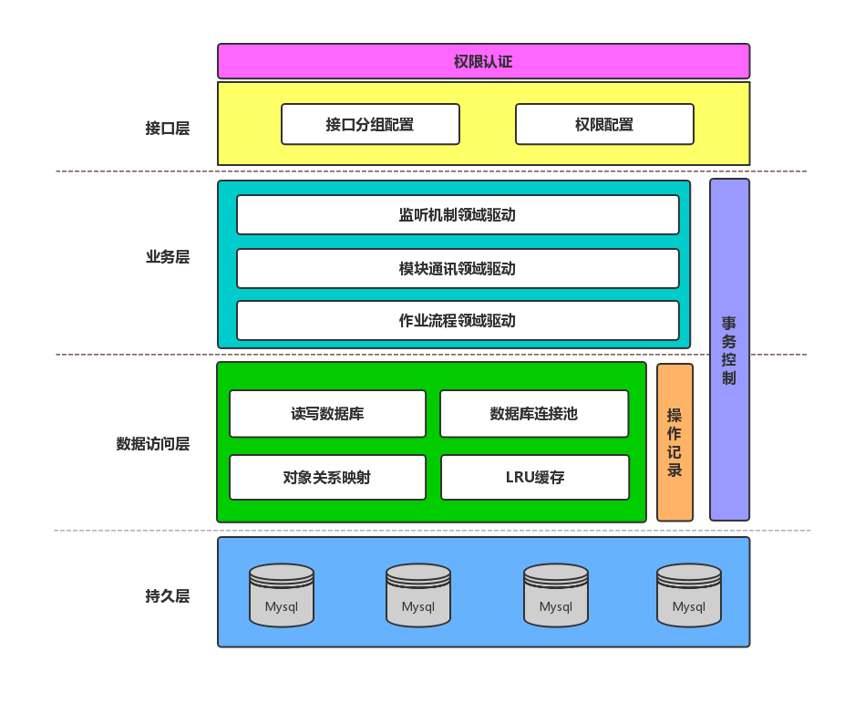

 

If you have any improvement, I will be happy to get a pull request from you! 

**Document [Link](https://www.yuque.com/shusheng/suibqb/rxi3sd)**

## License
[MIT](https://choosealicense.com/licenses/mit/)